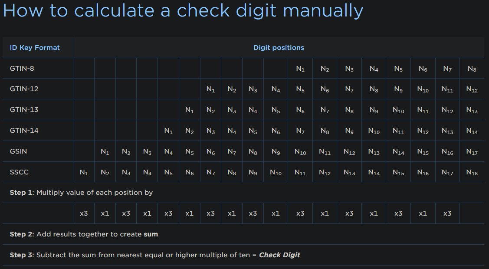

# EAN Check Digit Calculator

## What is a check digit?

From Wikipedia:

> "A check digit is a form of redundancy check used for error detection on identification numbers".

An example on how to calculate EAN check digits from the GS1.org website.

Read more [here](https://www.gs1.org/services/how-calculate-check-digit-manually).

## Reasoning behind this script

I was using [GS1.org](https://www.gs1.org/services/check-digit-calculator) to confirm check digits at work but you can only query one manually and then have to re-enter the input. This is highly inneficient when you want to query multiple at once so I built something that I could query multiple check-digits programmatically.
